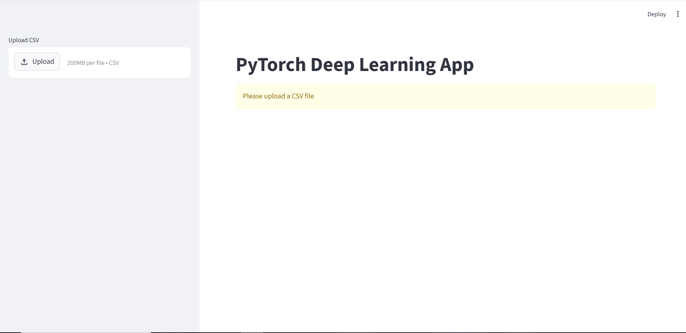
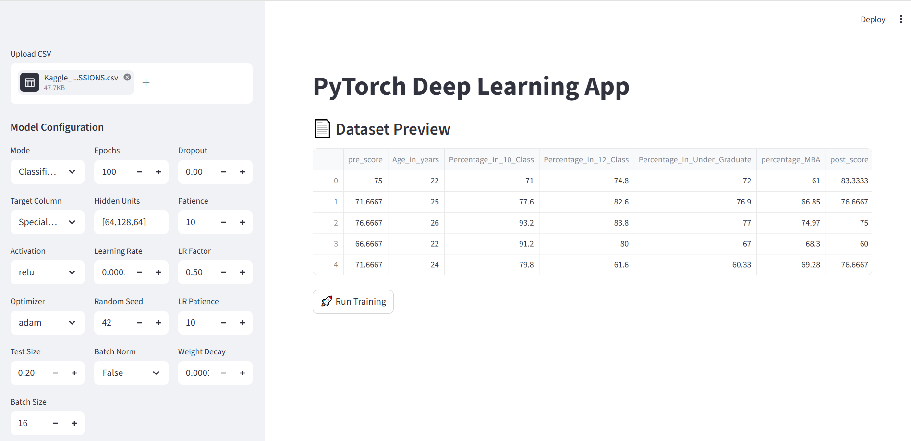
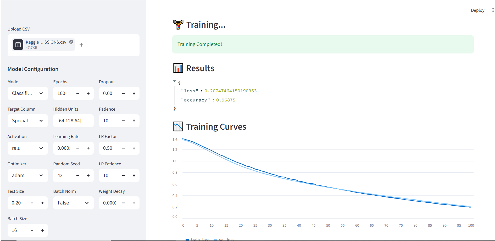
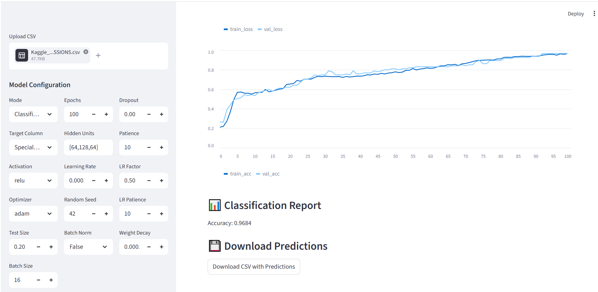

# PyTorch Supervised Learning App 

A lightweight PyTorch app for **classification and regression** with an interactive **Streamlit UI** includes training, evaluation, and prediction.
Ideal for quick experiments, demos, and teaching wih comprehensive evaluation metrics.
For flexible use across different datasets and tasks.

---
## Main Features

* Upload CSV datasets

* Supports:
    * Classification
    * Regression

* Interactive UI:
    * Select target column
    * Configure model & hyperparameters

* Built-in:
    * Training + validation
    * Early stopping
    * Learning rate scheduler

* Visualizations:
    * Loss curves
    * Accuracy curves (classification)

* Export predictions as CSV

---

## Repository Structure

```
data/
images/
src/
    app.py                  # Streamlit UI
    pytorch_pipeline.py     # Model + training (OOP)
requirements.txt
README.md
```
---

## Installation

```bash

python 3.11 

pip install -r requirements.txt

```
---

## Deployment
* Local: streamlit run app.py

Open: http://localhost:8501

* Cloud: deploy via Streamlit Cloud (GitHub repo → select app.py)
---

## Usage


**(a) Upload your CSV file**



**(b) Select classification or regression mode**

**Choose the target column for prediction**



**(c) 'Run Training' to view evaluation metrics and fine-tune the parameters if needed**



**(d) Download the updated CSV file with a new prediction column added**



---
## Key Params

units → hidden layers (e.g. [64,128,64])

activation → relu / tanh / sigmoid / leaky_relu

lr → learning rate

learning rate scheduling

batch_size, epochs, test_size

dropout_rate, batch_norm

patience → early stopping

---
## Outputs

1. Classification

    * Accuracy
    * Loss & accuracy curves

2. Regression

   *  MAE 
   * Loss curve

---
## Notes

* All columns except target are used as features
---
